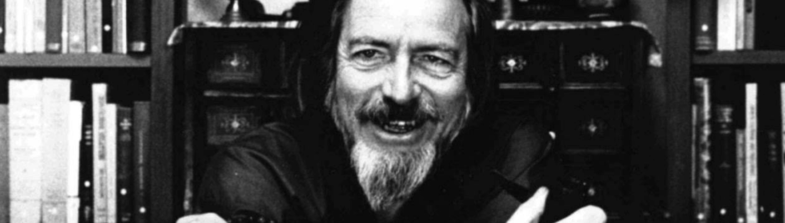

人们对翻译有什么看法？

> That's a waste of time. If you really understand Zen... you can use any book. You could use the Bible. You could use Alice in Wonderland. You could use the dictionary, because... the sound of the rain needs no translation. ~ Alan Watts

 

> Translation is entirely mysterious. Increasingly I have felt that the art of writing is itself translating, or more like translating than it is like anything else. What is the other text, the original? I have no answer. I suppose it is the source, the deep sea where ideas swim, and one catches them in nets of words and swings them shining into the boat… where in this metaphor they die and get canned and eaten in sandwiches. ~ Ursula Le Guin
